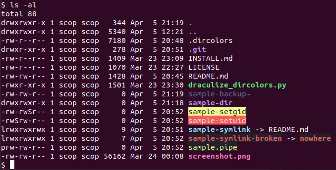

# Dracula for [dircolors](https://www.gnu.org/software/coreutils/manual/html_node/dircolors-invocation.html#dircolors-invocation)

> A dark theme for [dircolors](https://www.gnu.org/software/coreutils/manual/html_node/dircolors-invocation.html#dircolors-invocation), a utility for setting up color configuration for GNU ls, dir, and vdir output.

## Install

All instructions can be found at [draculatheme.com/dircolors](https://draculatheme.com/dircolors).

## Team

This theme is maintained by the following person(s) and a bunch of [awesome contributors](https://github.com/dracula/dircolors/graphs/contributors).

| ________ |
| ---------------------------------------------------------------------------------------- |
| [Ville Skyttä](https://github.com/scop)___                                               |

## Community

- [Twitter](https://twitter.com/draculatheme) - Best for getting updates about themes and new stuff.
- [GitHub](https://github.com/dracula/dracula-theme/discussions) - Best for asking questions and discussing issues.
- [Discord](https://draculatheme.com/discord-invite) - Best for hanging out with the community.

## License

[MIT License](./LICENSE)
